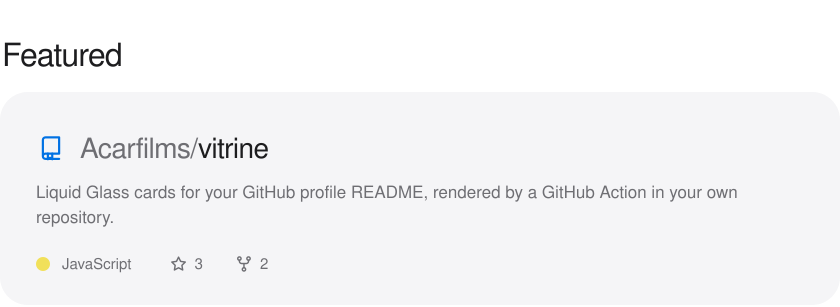
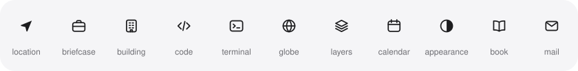

Vitrine turns one YAML file into the cards on your GitHub profile: a glass hero with your name, a bento of what you do, a featured repository, a tech specs table, a year of activity and a button for each of your links. A GitHub Action renders them as SVG files in your own repository, so nothing depends on a hosted card service.

The expertise, featured, specs and activity cards come in light and dark versions and follow GitHub's theme. The hero and the link buttons carry their own wallpaper and look the same in both.

## What it looks like

These are the cards on [my profile](https://github.com/Acarfilms), rendered from [`examples/vitrine.yml`](examples/vitrine.yml).


<picture>
  <source media="(prefers-color-scheme: dark)" srcset="docs/example/expertise-dark.svg">
  
</picture>

<a href="https://github.com/Acarfilms/vitrine">
<picture>
  <source media="(prefers-color-scheme: dark)" srcset="docs/example/featured-dark.svg">
  
</picture>
</a>

<picture>
  <source media="(prefers-color-scheme: dark)" srcset="docs/example/specs-dark.svg">
  
</picture>

<picture>
  <source media="(prefers-color-scheme: dark)" srcset="docs/example/activity-dark.svg">
  
</picture>

<p align="center">
  
  
</p>

## Quick start

GitHub shows the README of a public repository named after your username at the top of your profile. If you don't have that repository yet, create it first.

**1. Describe your profile.** Add a `vitrine.yml` at the root of that repository:

```yaml
hero:
  name: Jane Appleseed
  role: Product engineer
  tagline: Small teams, big launches.
  widgets:
    - { icon: location, label: Based in, value: Cupertino }
    - { icon: building, label: Working at, value: Acme }

specs:
  rows:
    - label: Languages
      items: [swift, typescript, python]

activity: true

links:
  - { icon: github, label: GitHub, url: https://github.com/jane }
```

**2. Add the workflow.** Save this as `.github/workflows/vitrine.yml`:

```yaml
name: Vitrine

on:
  push:
    paths: [vitrine.yml]
  schedule:
    - cron: '0 6 * * *'
  workflow_dispatch:

permissions:
  contents: write

concurrency: vitrine

jobs:
  render:
    runs-on: ubuntu-latest
    steps:
      - uses: actions/checkout@v5
      - uses: Acarfilms/vitrine@v1
```

It renders the cards into `vitrine/`, deletes any your config no longer makes, and commits the result when something changed. With an activity card, that means a small commit on most days, since the numbers move.

**3. Paste the markup.** Open the finished run in the Actions tab. Its summary has the HTML for your README, with the light and dark versions already paired. You only paste it once. After that, the workflow updates the images behind it.

## Configuration

Every section is optional, but the file needs at least one.

| Key | Default | |
| --- | --- | --- |
| `wallpaper` | `tide` | Background of the hero and the link buttons: `tide`, `dusk` or `graphite`. |
| `accent` | `blue` | Color of the eyebrows and the activity chart: `blue`, `indigo`, `purple`, `pink`, `orange`, `green`, `teal`, `red`, `yellow` or `mint`. |
| `language` | `en` | Language of the text Vitrine writes itself, such as the activity card and the default titles: `en`, `es`, `fr`, `de` or `pt`. Your own text is used as written. |
| `login` | Repository owner | Whose contribution calendar to read. Only needed when running Vitrine outside GitHub Actions. |

### Hero

```yaml
hero:
  name: Jane Appleseed
  role: Product engineer
  tagline: Small teams, big launches.
  widgets:
    - { icon: location, label: Based in, value: Cupertino }
    - { icon: building, label: Working at, value: Acme }
    - { icon: code, label: Focus, value: iOS · Web }
```

Only `name` is required. Up to three `widgets` sit along the bottom as glass panes, each with an `icon`, a small `label` and a `value`. Long text shrinks to fit, and is cut with an ellipsis if it still doesn't.

### Expertise

```yaml
expertise:
  title: Expertise
  tiles:
    - eyebrow: Apps & Web
      headline: [Native feel., Web speed.]
      body: Cross-platform apps in Flutter. Fast, modern web with Next.js.
      icons: [flutter, nextdotjs, typescript]
    - eyebrow: Design
      headline: Interfaces that explain themselves.
    - eyebrow: Leadership
      headline: From roadmap to release.
      icons: [linear, notion]
```

Each tile needs an `eyebrow` and a `headline`, and the card holds up to seven. The first tile spans the full width unless it sets `wide: false`. The rest pair up in order, two to a row, and a tile without a partner gets a row of its own. Set `wide: true` to give any tile the full width.

`headline` and `body` wrap by themselves. Pass a list instead of a string when you want to choose the line breaks. Full-width tiles show up to six `icons` as a grid of app icons; tiles that share a row fit three in the top corner. The `title` defaults to Expertise.

### Featured

```yaml
featured: Acarfilms/vitrine    # or { repo: Acarfilms/vitrine, title: Latest project }
```

One public repository, the way GitHub lists it: owner and name, the description, the main language, stars and forks. A long description is cut at two lines. In the README markup the card links to the repository, so it's clickable.

Like the activity card, it reads GitHub with the workflow's token, which can read any public repository. Private repositories are refused, because the card would put their name and description on your profile. The `title` defaults to Featured.

### Tech specs

```yaml
specs:
  title: Tech specs
  rows:
    - label: Mobile
      items: [swift, kotlin, { icon: react, label: React Native }]
    - label: Data
      items: [postgresql, redis]
```

A row has a `label` and up to four `items`. An item is an icon, shown with the brand's own name, or `{ icon, label }` to call it something else. The `title` defaults to Tech specs.

### Activity

```yaml
activity: true    # or { title: This year }
```

Contributions, active days and streaks over the last 12 months, with a bar for each week and a dashed line at the weekly average. Its labels, month names and numbers follow `language`. It reads the same calendar GitHub draws on your profile, using the workflow's own token. Contributions to private repositories are counted only if you have turned on **Include private contributions on my profile** in your profile settings.

### Links

```yaml
links:
  - { icon: linkedin, label: LinkedIn, url: https://www.linkedin.com/in/jane }
  - { icon: x, label: X, url: https://x.com/jane }
  - { icon: mail, label: Email, url: 'mailto:jane@example.com' }
```

Each link becomes a separate glass button, so each one is clickable in the README. You can add up to six, with labels of up to 24 characters and URLs that start with `http://`, `https://` or `mailto:`.

## Wallpapers

<p>
  
  
  
</p>

## Icons

Wherever a card takes an icon, use its slug from [Simple Icons](https://simpleicons.org), which covers more than 3,400 brands. Slugs are not always what you'd guess, so a miss comes with a suggestion:

```
vitrine.yml: specs.rows[0].items[1] "nextjs" is not a Simple Icons slug (https://simpleicons.org). Did you mean "nextdotjs"?
```

Brand colors are adjusted for each theme, so a black logo never disappears on a dark tile. LinkedIn, which Simple Icons no longer ships, is included.

Hero widgets and links can also use these symbols:

<picture>
  <source media="(prefers-color-scheme: dark)" srcset="docs/symbols-dark.svg">
  
</picture>

## Action inputs

| Input | Default | |
| --- | --- | --- |
| `config` | `vitrine.yml` | Path to the config file. |
| `output` | `vitrine` | Folder the cards are written to. |
| `readme` | `README.md` | The README the cards appear in. Image paths in the run summary are relative to it. |
| `token` | `github.token` | Token used to read the contribution calendar and the featured repository. |
| `commit` | `true` | Commit the cards when they change. Set it to `false` to handle that in a later step. |
| `commit-message` | `Update profile cards` | Message for that commit. |

## Running locally

With Node 22 or later:

```sh
npx github:Acarfilms/vitrine --config vitrine.yml --out vitrine
```

Add `--snippet` to print the README markup instead of the list of files, or `--help` for the other options. Use `--version` (or `-v`) to print the version and exit. The activity and featured cards also need a token, and the activity card needs `login` in the config:

```sh
GITHUB_TOKEN=$(gh auth token) npx github:Acarfilms/vitrine
```

## How the glass works

SVG has no `backdrop-filter`, and GitHub shows README images through an `` tag, which rules out scripts and external fonts. So each pane draws the wallpaper a second time through a `<use>` reference: scaled up 8%, blurred, saturated and brightened, then clipped to the pane. A faint white tint and a vertical sheen go on top, then a soft band along the inside edge and a rim that catches the light on two opposite corners.

The text is set in [Inter](https://rsms.me/inter/), embedded in each file as a WOFF2 subset of about 15 KB per weight that covers Western and Central European languages. Its display cut is close to SF Pro, which can't be redistributed. With no browser around to lay out text, Vitrine measures every line with Inter's advance widths to wrap headlines and shrink long values.

## FAQ

**Why not github-readme-stats?** Hosted card services share one GitHub API quota between everyone who uses them, and their cards break when it runs out. Vitrine runs in your repository with your token, and after that the cards are plain files.

**Can I change the order of the cards?** Yes. Each card is a separate image, so you can move its block anywhere in your README or leave it out.

**Does it work for organizations?** Yes, except for the activity card, which reads a person's contribution calendar and stops the run with an error on an organization. An organization's profile README lives at `profile/README.md` in its `.github` repository, so set `readme: profile/README.md` and an `output` such as `profile/vitrine` to get the right image paths.

**How do the cards look on a phone?** They scale down with the page. The text is part of the image, so it gets smaller on narrow screens instead of reflowing.

## Credits

Text is set in Inter by Rasmus Andersson, under the [SIL Open Font License](src/assets/Inter-OFL.txt). Brand icons come from [Simple Icons](https://github.com/simple-icons/simple-icons) under CC0, and brand names and logos belong to their owners. The look takes its cues from Apple's Liquid Glass; Vitrine is not affiliated with Apple.

## License

[MIT](LICENSE)
